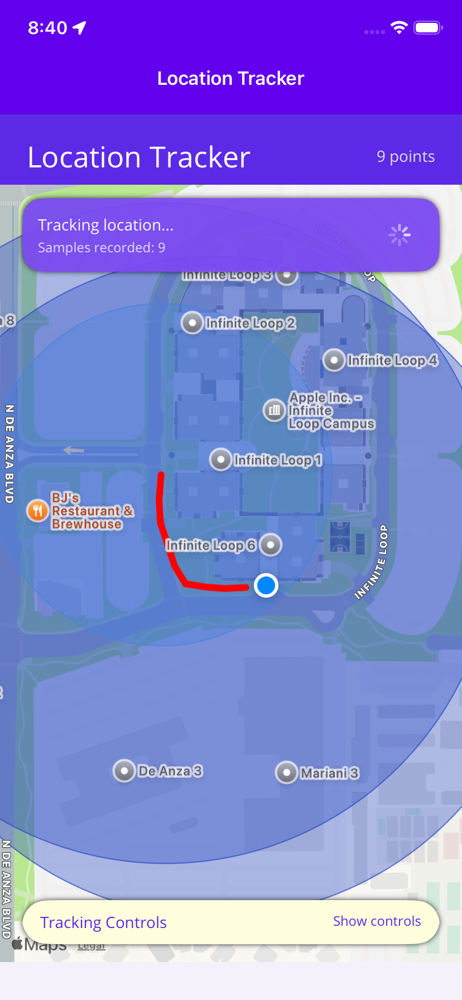
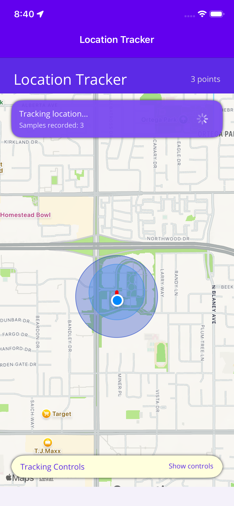

# NavigationTracker

NavigationTracker is a .NET MAUI sample that records the user's location, stores the path in SQLite, and renders the trail as a heat map. The UI mirrors the reference design provided in the assignment: a purple brand bar, floating status card, and a collapsible control panel that can be minimized when you want to see more of the map.

## Features

- **Live location tracking** using `IGeolocation` with error handling for permission/feature failures.
- **SQLite persistence** (`sqlite-net-pcl`) through a lightweight repository so location history survives app restarts.
- **Heat map rendering** by grouping coordinates into density buckets and drawing translucent circles on `Map.MapElements`.
- **Collapsible tracker controls**: status card, start/stop, clear, refresh, and center actions sit in a bottom sheet that you can toggle.
- **Cross-platform targets**: Android, iOS, Mac Catalyst (Windows packaging disabled by default).

## Project Structure

```
NavigationTracker/
 ├── Data/                 # SQLite repository (create/read/delete)
 ├── Helpers/              # AsyncCommand, color scale, service helper
 ├── Models/               # TrackPoint + HeatMapPoint POCOs
 ├── Services/             # LocationTrackingService + HeatMapBuilder
 ├── ViewModels/           # MainViewModel (MVVM state + commands)
 ├── MainPage.xaml(.cs)    # UI layout and map rendering logic
 ├── MauiProgram.cs        # DI + UseMauiMaps registration
 └── Platforms/            # platform specific manifests and permissions
```

## Prerequisites

- .NET 8 (or .NET 7 with MAUI workloads, though this template uses net10.0 targets)
- Visual Studio 2022 (17.8+ on Windows) or Visual Studio for Mac 2022 / VS Code with `dotnet` CLI
- MAUI workloads installed:
  ```bash
  dotnet workload install maui-android maui-ios maui-maccatalyst
  ```
- Xcode 15/16 with the appropriate simulator runtimes (for iOS/Mac Catalyst)
- Android SDK + emulators if you plan to run Android

## Running the app

### 1. Restore and build
```bash
cd NavigationTracker
dotnet restore NavigationTracker/NavigationTracker.csproj
```

### 2. Launch on a simulator/emulator

**iOS simulator**
```bash
dotnet build -t:Run NavigationTracker/NavigationTracker.csproj \
  -f net10.0-ios \
  -p:_DeviceName=":v2:platform=iOS Simulator,name=iPhone 17 Pro Max"
```
> If you have a specific simulator UDID, you can use `-p:_DeviceName=":v2:udid=<UDID>"`.

**Android**
```bash
dotnet build -t:Run NavigationTracker/NavigationTracker.csproj \
  -f net10.0-android
```
Make sure an emulator is already booted (`adb devices` should list it).

**Mac Catalyst**
```bash
dotnet build -t:Run NavigationTracker/NavigationTracker.csproj \
  -f net10.0-maccatalyst
```

### 3. Physical devices

- **iOS**: provide a valid Apple Development certificate and provisioning profile, then run:
  ```bash
  dotnet publish NavigationTracker/NavigationTracker.csproj \
    -f net10.0-ios -c Release -p:RuntimeIdentifier=ios-arm64 \
    -p:CodesignKey="Apple Development: Your Name (TEAMID)" \
    -p:CodesignProvision="Your Provisioning Profile"
  ```
  Install the generated `.ipa` via Xcode or Apple Configurator.

- **Android**: connect a device with USB debugging enabled. `dotnet build -t:Run ... -f net10.0-android` will deploy automatically. For release, create a keystore and sign via `dotnet publish`.

## Permissions & Config

- `Platforms/Android/AndroidManifest.xml` includes foreground/background location and Google Maps key metadata (`Resources/values/google_maps_api.xml`).
- `Platforms/iOS/Info.plist` & `Platforms/MacCatalyst/Info.plist` declare the required `NSLocation*UsageDescription` strings.
- Windows package includes `DeviceCapability Name="location"`.

## Heat Map Logic

`HeatMapBuilder` groups track points by rounded coordinates, determines the highest density, and returns `HeatMapPoint` items with color from `HeatColorScale`. The UI iterates those points, creating `Circle` elements on the MAUI map, while the track uses a red `Polyline`.

## Troubleshooting

- **Simulator not found**: ensure `_DeviceName` references an installed simulator. Check `xcrun simctl list devices`.
- **mlaunch HE0046**: reboot/erase the simulator (`xcrun simctl erase <UDID>`) or create a new device.
- **Permission prompts**: grant location permission the first time the app runs. On Android 10+, also allow background location if you want continuous tracking.
- **"Socket error connecting to IDE"**: happens when VS/Simulator loses connection. Close the simulator and rerun the command; if running from CLI only, ignore the warning.

## Screenshots

| Running state | Collapsed controls |
| --- | --- |
|  |  |

(Add screenshots under a `docs/` folder if desired.)

## License

This codebase was created for the UCumberlands MSCS-533 assignment; no explicit license is applied. Feel free to adapt it for personal or academic use.***
